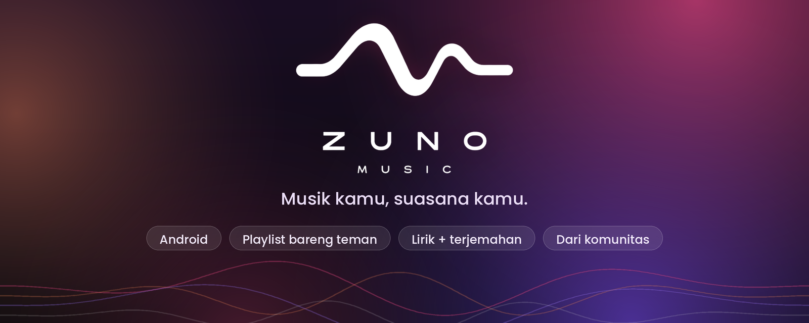
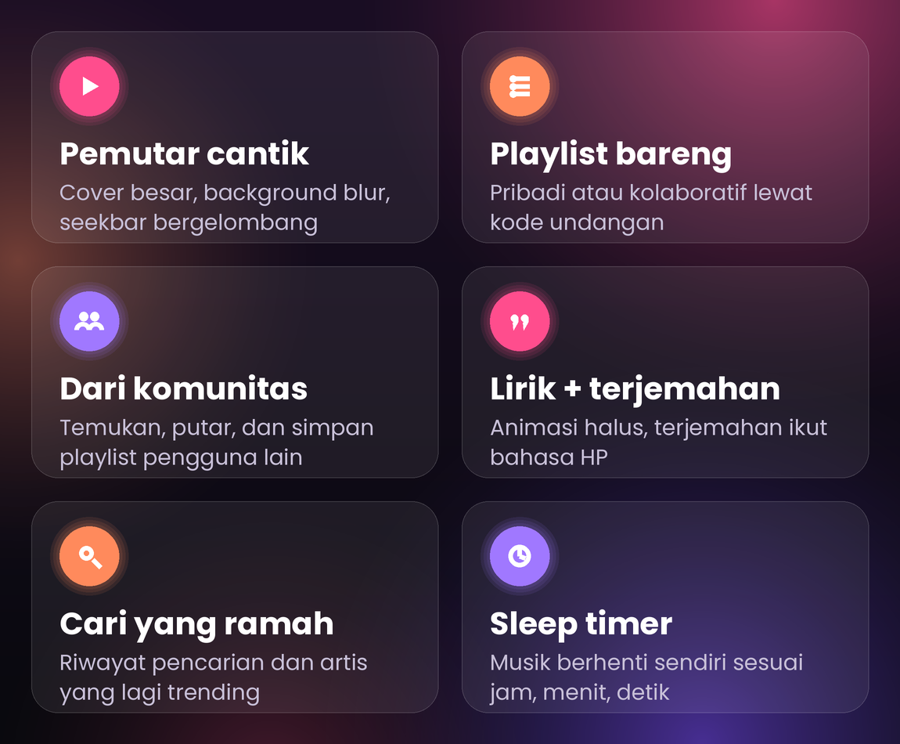

 

Aplikasi musik streaming Android yang simpel, cantik, dan ramah. 
Dengerin lagu, bikin playlist bareng teman, dan temukan musik dari komunitas.

 

 

&nbsp;

 

[Fitur](#-fitur) &nbsp;·&nbsp; [Cara install](#-cara-install) &nbsp;·&nbsp; [Tampilan](#%EF%B8%8F-tampilan) &nbsp;·&nbsp; [FAQ](#-faq) &nbsp;·&nbsp; [Dukung](#-dukung-developer) &nbsp;·&nbsp; [Developer](#-developer)

 

## ✨ Fitur

 

<b>🎧 Pemutar yang enak dilihat</b>

 

Cover besar, background blur yang ngikut warna cover, seekbar bergelombang yang "berjalan", mini player, dan kontrol langsung dari notifikasi. Slider volume bisa dibuka dan ditutup biar layar nggak padat.

<b>📚 Playlist pribadi & bareng teman</b>

 

Bikin playlist sendiri, atau bikin **playlist kolaboratif** dan ajak teman lewat kode undangan. Semua orang bisa nambah lagu.

<b>🌍 Dari komunitas</b>

 

Temukan playlist buatan pengguna lain di Beranda. Putar langsung, lalu **simpan ke Library** kamu. Mau berbagi? Publikasikan playlist-mu dengan satu tap dan tarik lagi kapan saja.

<b>🎤 Lirik + terjemahan</b>

 

Layar lirik dengan animasi pindah baris yang halus. Terjemahan otomatis tampil di bawah lirik asli sesuai bahasa HP kamu.

<b>✨ Lainnya</b>

 

| | |
|---|---|
| 🔍 **Cari** | Cari judul atau artis, riwayat pencarian, dan artis trending |
| ⏰ **Sleep timer** | Atur jam, menit, dan detik, lalu musik berhenti sendiri |
| ❤️ **Disukai & Koleksi** | Simpan lagu favorit dan kelola koleksimu |
| 🔐 **Login Google** | Masuk sekali tap, tanpa bikin akun baru |
| 🌐 **Multi bahasa** | Indonesia, English, Español, ikut bahasa default HP |
| 🐞 **Ajukan bug** | Lapor masalah langsung ke developer dari Pengaturan |

---

## 📲 Cara install

| Langkah | Yang dilakukan |
|:---:|---|
| **1** | Buka halaman **[Releases](../../releases/latest)** dan unduh file `.apk` terbaru |
| **2** | Buka file APK di HP kamu |
| **3** | Kalau diminta, aktifkan **"Install dari sumber tidak dikenal"** untuk browser atau file manager yang kamu pakai |
| **4** | Tap **Install**, buka **Zuno Music**, lalu masuk dengan akun Google |

> 💡 Zuno Music butuh koneksi internet untuk memutar lagu dan memuat komunitas.

---

## 🖼️ Tampilan

<!-- Upload screenshot ke folder `screenshots/` di repo, lalu hapus tanda komentar di bawah.
     Tips: pakai layar yang nggak menampilkan cover album orang lain (Pengaturan, dialog Ajukan bug, layar Cari kosong),
     atau tutup cover-nya, supaya repo nggak memuat gambar yang bukan milikmu. -->
<!--

  
  
  
  

-->

<i>Screenshot segera menyusul.</i>

---

## 🛠️ Teknologi

---

## ❓ FAQ

<b>Apakah Zuno Music gratis?</b>

 

Ya, gratis dipakai. Kamu bisa mendukung developer secara sukarela lewat QRIS di menu Pengaturan.

<b>Kenapa harus login Google?</b>

 

Supaya playlist, lagu yang kamu sukai, dan koleksimu tersimpan di akunmu dan ikut pindah kalau kamu ganti HP.

<b>Muncul peringatan saat install APK, aman nggak?</b>

 

Itu peringatan standar Android untuk aplikasi yang dipasang di luar Play Store. Unduh APK hanya dari halaman **Releases** resmi repo ini.

<b>Bagaimana cara bagi playlist ke komunitas?</b>

 

Buka playlist, tap menu titik tiga, lalu pilih **Bagikan ke komunitas**. Playlist muncul di baris "Dari komunitas" setelah punya minimal satu lagu, dan bisa ditarik lagi kapan saja.

---

## 💖 Dukung developer

Suka sama Zuno Music? Dukung lewat menu **Pengaturan > Dukung developer** di dalam aplikasi (QRIS). Setiap dukunganmu bikin Zuno makin berkembang. Makasih banyak! 🙏

## 🐛 Nemu bug atau punya saran?

Buka **Pengaturan > Ajukan bug** di dalam aplikasi, atau buat **[Issue](../../issues)** di repo ini. Sertakan versi aplikasi, tipe HP, dan langkah sampai masalahnya muncul.

## 👤 Developer

**Oxrix** · GitHub [@rizkimuhamad123sdmyy-hash](https://github.com/rizkimuhamad123sdmyy-hash)

---

© 2026 Oxrix. All rights reserved.

Repositori ini hanya untuk distribusi aplikasi. 
Dilarang menyalin, membongkar, mengubah, mendistribusikan ulang, atau menjual Zuno Music tanpa izin tertulis dari developer.

