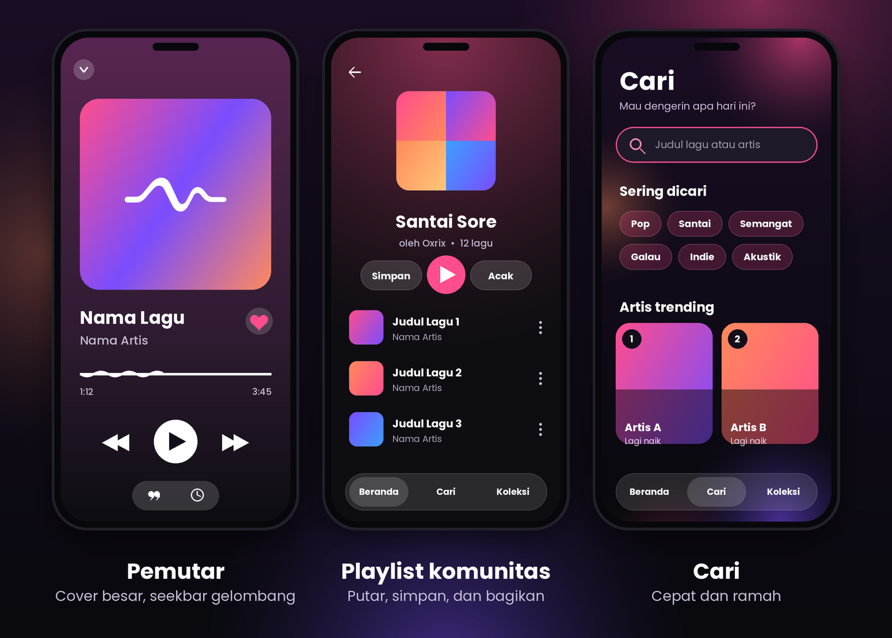

 

### Dengerin lagu, bikin playlist bareng teman, dan temukan musik baru dari komunitas.

Zuno Music adalah aplikasi musik streaming untuk Android dengan tampilan gelap yang bersih, animasi halus, dan fitur sosial yang bikin dengerin musik jadi lebih seru.

 

 

&nbsp;

 

[Tentang](#-tentang) &nbsp;·&nbsp; [Fitur](#-fitur) &nbsp;·&nbsp; [Tampilan](#%EF%B8%8F-tampilan) &nbsp;·&nbsp; [Install](#-cara-install) &nbsp;·&nbsp; [Cara pakai](#-cara-pakai) &nbsp;·&nbsp; [FAQ](#-faq) &nbsp;·&nbsp; [Developer](#-developer)

 

## 💡 Tentang

**Zuno Music** dibuat untuk kamu yang pengin pengalaman dengerin musik yang simpel, enak dilihat, dan nggak ribet. Semua lagu dan data kamu disimpan di server, jadi aplikasinya ringan dan tetap rapi di HP mana pun.

| | |
|---|---|
| 🎨 **Tampilan cantik** | Tema gelap dengan efek kaca (glass), background blur yang ngikut warna cover lagu, dan animasi yang halus. |
| 🤝 **Sosial** | Bikin playlist bareng teman, bagikan ke komunitas, dan temukan playlist buatan orang lain. |
| 🌐 **Ramah untuk semua** | Tersedia dalam Bahasa Indonesia, English, dan Español, otomatis ikut bahasa HP kamu. |
| 🆓 **Gratis** | Dipakai gratis. Dukungan ke developer sepenuhnya sukarela. |

---

## ✨ Fitur

 

### 🎧 Pemutar musik
- **Cover besar** dengan **background blur** dari warna cover lagu yang sedang diputar.
- **Seekbar bergelombang** yang "berjalan" saat lagu diputar, lengkap dengan waktu berjalan dan total durasi.
- Tombol **sebelumnya, putar/jeda, dan berikutnya** berukuran besar, nyaman dipencet satu tangan.
- **Mini player** dengan background blur dan garis progres, bisa dibuka jadi layar penuh kapan saja.
- **Autoplay**, **ulangi lagu**, dan **bagikan lagu** langsung dari pemutar.
- **Slider volume** yang bisa dibuka dan ditutup supaya layar nggak padat, plus info perangkat output (misalnya "Speaker HP").
- **Sleep timer**: atur jam, menit, dan detik, lalu musik berhenti sendiri.

### 🏠 Beranda yang hidup
- **Terakhir diputar**, **Baru ditambahkan**, dan **Albummu** dalam baris kartu yang bisa digeser.
- Rekomendasi seperti **Favoritmu**, **Paling sering diputar**, dan **Artis kamu**, menyesuaikan kebiasaan dengerinmu.
- **Dari komunitas**: playlist buatan pengguna lain, langsung bisa diputar.

### 📚 Playlist
- Buat **playlist pribadi**, atau **playlist kolaboratif** yang bisa diisi bareng teman lewat **kode undangan**.
- Cover playlist berupa **kolase 4 gambar** dari lagu di dalamnya.
- Menu lengkap: putar, tambah ke antrean, ganti nama, pin ke atas, bagikan, dan hapus.
- Kode undangan bisa dibuat ulang kapan saja kalau kamu mau mencabut akses lama.

### 🌍 Komunitas
- **Bagikan playlist** ke komunitas dengan satu tap, dan tarik lagi kapan saja. Nama kamu tampil sebagai pembuatnya.
- Playlist komunitas diurutkan dari yang **paling banyak dilihat**, lengkap dengan jumlah tontonan.
- Ketemu playlist bagus? **Simpan ke Library** kamu sebagai salinan pribadi.
- Kalau playlist buatan pengguna masih sedikit, Zuno mengisi baris komunitas dengan **playlist otomatis** seperti *Baru Dirilis*, *Lagi Naik Minggu Ini*, *Paling Sering Diputar*, *Terbaik dari (artis)*, dan *Campuran Hari Ini*.

### 🎤 Lirik dan terjemahan
- Layar lirik dengan **animasi pindah baris yang halus**, tombol yang otomatis hilang kalau lama nggak disentuh biar fokus ke lirik.
- **Terjemahan lirik** tampil di bawah lirik asli, sesuai bahasa default HP kamu.

### 🔍 Cari
- Cari berdasarkan **judul atau artis**, dengan filter *Semua*, *Judul*, dan *Artis*.
- **Riwayat pencarian** yang bisa dihapus satu per satu atau semuanya.
- **Sering dicari** dan **artis trending** buat inspirasi kalau lagi bingung mau dengerin apa.

### 👤 Akun dan pengaturan
- **Login Google**: sekali tap, tanpa bikin akun baru. Playlist dan koleksimu ikut pindah ke HP baru.
- Pilih **bahasa aplikasi**, bersihkan cache, dan kelola akun, termasuk hapus akun beserta data.
- **Ajukan bug** langsung dari aplikasi, lengkap dengan pilihan kategori masalah. Info versi app dan perangkat ikut terkirim otomatis.
- **Dukung developer** lewat QRIS.

---

## 🖼️ Tampilan

<i>Ilustrasi tampilan aplikasi. Warna dan isi di aplikasi asli menyesuaikan lagu dan akunmu.</i>

---

## 📲 Cara install

| Langkah | Yang dilakukan |
|:---:|---|
| **1** | Buka halaman **[Releases](../../releases/latest)** dan unduh file `.apk` terbaru. |
| **2** | Buka file APK di HP kamu. |
| **3** | Kalau diminta, aktifkan **"Install dari sumber tidak dikenal"** untuk browser atau file manager yang kamu pakai. |
| **4** | Tap **Install**, buka **Zuno Music**, lalu masuk dengan akun Google. |

> 💡 Zuno Music butuh koneksi internet untuk memutar lagu dan memuat komunitas.

**Update aplikasi:** unduh APK versi terbaru dari Releases, lalu pasang di atas yang lama. Data dan playlist kamu tetap aman karena tersimpan di akunmu.

---

## 🚀 Cara pakai

1. **Masuk** dengan akun Google.
2. **Cari lagu** lewat tab **Cari**, atau pilih dari Beranda.
3. **Putar**, lalu tap mini player untuk membuka pemutar penuh. Geser ke atas untuk membuka lirik.
4. **Bikin playlist**: buka tab **Koleksi**, buat playlist baru, lalu tambahkan lagu. Aktifkan mode kolaboratif dan kirim kode undangan ke temanmu.
5. **Bagikan ke komunitas**: buka playlist, tap titik tiga, pilih **Bagikan ke komunitas**.
6. **Tidur sambil dengerin**: pakai ikon jam di pemutar untuk menyalakan **sleep timer**.

---

## 🛠️ Teknologi

| Bagian | Teknologi |
|---|---|
| Aplikasi | Android (Java), tampilan dibuat dengan XML |
| Server | Node.js |
| Database | PostgreSQL |
| Login | Google Sign-In |

---

## 📝 Catatan rilis

### v1.0: rilis pertama
- Pemutar musik dengan background blur, seekbar bergelombang, mini player, dan sleep timer.
- Playlist pribadi dan kolaboratif dengan kode undangan.
- Baris **Dari komunitas** dengan playlist publik dan playlist otomatis.
- Lirik dengan terjemahan.
- Pencarian dengan riwayat dan artis trending.
- Login Google, 3 bahasa (Indonesia, English, Español), dan fitur ajukan bug.

---

## ❓ FAQ

<b>Apakah Zuno Music gratis?</b>

 

Ya, gratis dipakai. Kamu bisa mendukung developer secara sukarela lewat QRIS di menu Pengaturan.

<b>Kenapa harus login Google?</b>

 

Supaya playlist, lagu yang kamu sukai, dan koleksimu tersimpan di akunmu dan ikut pindah kalau kamu ganti HP.

<b>Muncul peringatan saat install APK, aman nggak?</b>

 

Itu peringatan standar Android untuk aplikasi yang dipasang di luar Play Store. Unduh APK hanya dari halaman **Releases** resmi repo ini.

<b>Bagaimana cara bagi playlist ke komunitas?</b>

 

Buka playlist, tap menu titik tiga, lalu pilih **Bagikan ke komunitas**. Playlist muncul di baris "Dari komunitas" setelah punya minimal satu lagu, dan bisa ditarik lagi kapan saja lewat menu yang sama.

<b>Bisa dengerin tanpa internet?</b>

 

Belum. Lagu diputar dari server, jadi dibutuhkan koneksi internet.

<b>Gimana cara ganti bahasa aplikasi?</b>

 

Bahasa otomatis mengikuti bahasa HP kamu. Kamu juga bisa mengubahnya dari **Pengaturan > Bahasa**.

<b>Gimana cara hapus akun dan data saya?</b>

 

Buka **Pengaturan > Hapus akun**. Akun dan semua lagu yang kamu upload akan dihapus permanen.

<b>Kodenya open source?</b>

 

Tidak. Repo ini hanya untuk distribusi aplikasi, dan semua hak cipta tetap pada developer.

---

## 💖 Dukung developer

Suka sama Zuno Music? Dukung lewat menu **Pengaturan > Dukung developer** di dalam aplikasi (QRIS). Setiap dukunganmu bikin Zuno makin berkembang. Makasih banyak! 🙏

## 🐛 Nemu bug atau punya saran?

Buka **Pengaturan > Ajukan bug** di dalam aplikasi, atau buat **[Issue](../../issues)** di repo ini. Sertakan versi aplikasi, tipe HP, dan langkah sampai masalahnya muncul. Makin jelas, makin cepat diperbaiki.

## 👤 Developer

**Oxrix** · GitHub [@rizkimuhamad123sdmyy-hash](https://github.com/rizkimuhamad123sdmyy-hash)

---

© 2026 Oxrix. All rights reserved.

Repositori ini hanya untuk distribusi aplikasi. 
Dilarang menyalin, membongkar, mengubah, mendistribusikan ulang, atau menjual Zuno Music tanpa izin tertulis dari developer.

